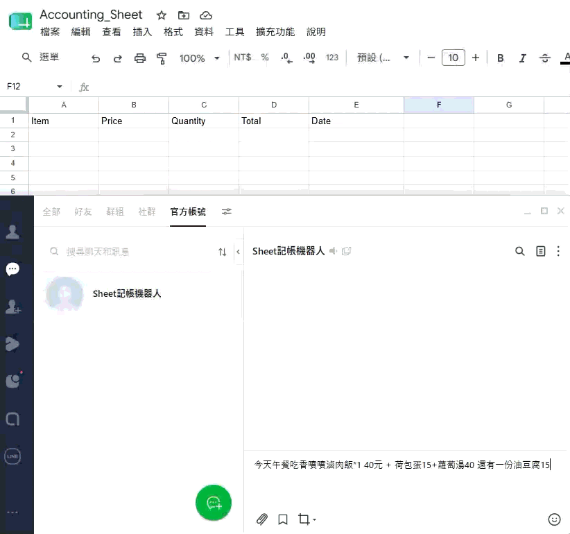

# Line 記帳機器人 (Google sheet)

### 功能簡介
在 Line 使用自然語言，透過 Gemini LLM 來解析出帳務資訊，存到指定的 Google sheet 裡。

### Demo

### 使用方式
Clone 此專案，或是 Fork 到你自己的 repo，將專案與 Vercel 做綁定，設定好需要的環境變數後，即可開始使用服務。

### 第三方服務
- [Supabase](https://app.notion.com/p/Line-to-Google-sheet-3b79bf9d57a08038b2e9decfa9fe6aa5#3b79bf9d57a08033ad6ad6f50fc6a478)
- [Google GCP API service & Gemini API](https://app.notion.com/p/Line-to-Google-sheet-3b79bf9d57a08038b2e9decfa9fe6aa5#3b89bf9d57a08077a700c9d770853dac)
- [Line business/Developer account](https://app.notion.com/p/Line-to-Google-sheet-3b79bf9d57a08038b2e9decfa9fe6aa5#3b89bf9d57a080c8b947d48986fd22e0)
- [Vercel](https://app.notion.com/p/Line-to-Google-sheet-3b79bf9d57a08038b2e9decfa9fe6aa5#3b89bf9d57a0808d87a8c9c6654d6f20)

### 完整使用文件
[使用文件](https://app.notion.com/p/Line-to-Google-sheet-3b79bf9d57a08038b2e9decfa9fe6aa5)
